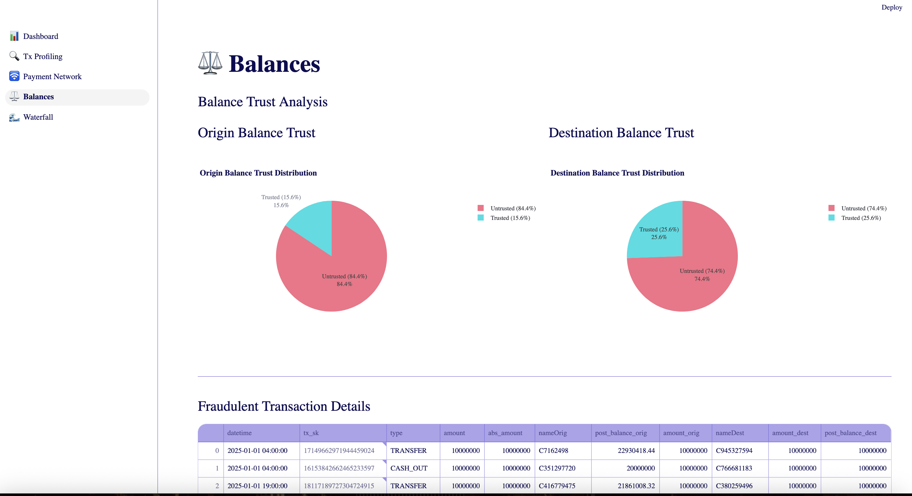

# Analysis & Dashboard of PaySim Financial Transaction Data

## Scott Goley

-------

## Goals

* A write-up of your methodology

* Key insights or trends from the data

-------

## Topics to cover

* Explain what steps you took to validate and cleanse the data.
* What did you do to explore trends or patterns in the data?
* How did you decide which insights to highlight from the data?
* What additional information or context might have been useful in forming your conclusions?

-------

## Project Materials

* [Github Repo](https://github.com/sgoley/paysim-dashboard) 
* [Streamlit Cloud Dashboard](https://sg-paysim-dashboard.streamlit.app)

-------

## Validation & Cleansing

* I made a transaction surrogate key to handle for duplication
  * `hash( datetime || Type || nameOrig || nameDest || amount )`
* I confirmed that dataset does not contain obvious duplicates
* I confirmed the time range of dataset (approximately covering a 31 day period truncated to hours)
* I made an adjustment from `step` to a datetime data type for easier graphing
* I made an adjustment on tx amount based on apparent direction (Transfer = Credit from Origin, Debit to Destination)
* I made new balances calculations on both the Origin & Destination accounts.
* I made boolean field to determine if the given vs the calculated Origin & Destination balances were the same.

-------

## Explore

* The dataset contains approximately 6.36M total transactions
* It contains about 6.35M sending accounts and 2.72M receiving accounts
* 8.21K were flagged via the `isFraud` boolean variable
* With $12B* in flagged transactions, this appoximates to 1% of the total 1.14T* in notional value and 0.1% of transaction count.
  * \* _absolute notional values_

-------

-------

## Explore - Dashboard

* The dashboard itself features most of these metrics as a headline for frequent viewing
* The primary featured chart is targeted to viewing proportion of fraudulent transactions over time vs non fraud.

-------

-------

## Explore - Preview

* The table version of the dataset is configured to make frequently accessed filters available for review & download:
  1. Top 100 Value Tx
  2. Latest 100 Tx
  3. 20 Random Each Tx Type
  4. 100 Fraud
* Or potentially many other variations on request.

-------

-------

## Explore - Profiling

* For high level profiling of the transactions and a few characteristics of the population vs fraudulent transactions:
  1. All occur as part of the `CASH_OUT` or `TRANSFER` tx types.
  2. Of the `CASH_OUT` transactions, they tend to feature a significantly higher median and higher average notional value than non-fraudulent transactions.

-------

-------

## Explore - Hours

* An additional feature of flagged transactions are:
  1. A significant proportion occur at a low point in transaction volume.
     1. Due to my datetime adjustment, this appears to be between the 3am - 7am hours of the day but requires further context to confirm.
  2. This is true of both `CASH_OUT` and `TRANSFER` types of flagged transactions.

-------

-------

## Explore - Graph

* Finally - I produced a graph exploration view so that single actors which were either the sender or receiver of a flagged `isFraud` can be deeply inspected in the context of their other transactions & counterparties.
* One of the most important characteristics observed here is that nearly every transaction originates from a single location though some share a common destination.

-------

-------

## Explore - Balances

* This perspective shows that very few of the balance calculations on accounts match between the original and calculated balances and could possible be an indicator the `isFraud` flag.
* If we assume that fraudulent transaction in the same exact amount are linked, the movement becomes obvious:
    1. Initiate a `TRANSFER` to an account of bad actor control
    2. Initiate a `CASH_OUT` transaction for the full quantity captured.

-------

-------

## Explore - Waterfall

* This perspective shows on the receiving / destination account side how various transactions are received by what could possibly be a merchant or aggregator account.
* The appearance is:
  * All fraudulent transactions initiate as the only recent transaction for a given individual account
  * A `TRANSFER` operation takes place to a destination account
  * One or more `CASH_OUT` transactions take place from the destination. (Hallmark layering)

## Additional Context

* Would be helpful to get account classification between personal individual vs business,  operational omnibus etc.
* Would be helpful to compare vs additional time periods.
* Would be helpful to get more datetime granularity or even a transaction index to ensure exact order rather than inferring order since lots of the `TRANSFER` & `CASH_OUT` pairs happen within the same time step.